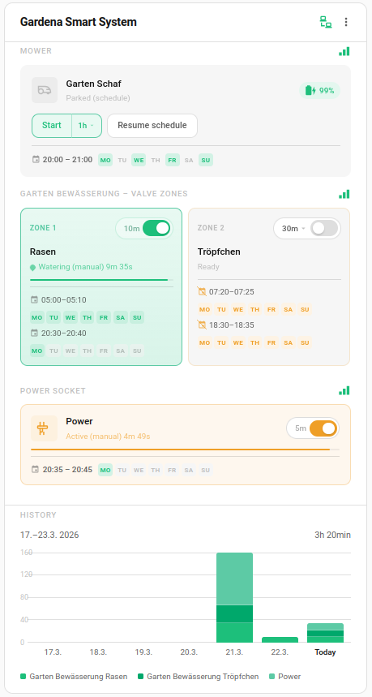

# Gardena Smart Schedule

A **Home Assistant custom integration** that fetches scheduling data from the **Gardena Smart System** cloud API and exposes it as sensor entities.

This integration is designed as an optional companion to the [Gardena Smart System Card](https://github.com/mtheli/gardena-smart-system-card), enabling it to display schedule information (times and weekdays) directly on the card.

## Features

- Reads schedule data from the Husqvarna/Gardena Cloud API
- Supports all Gardena device types (mowers, irrigation controls, water controls, power sockets)
- Multi-valve support with per-valve schedule sensors
- Schedule pause state tracking
- OAuth authentication with automatic token refresh
- Configurable polling interval (15–1440 minutes, default: 60)
- Multi-location support (multiple gardens)
- Re-authentication and reconfiguration flows

## Requirements

- A [Husqvarna Developer Portal](https://developer.husqvarnagroup.cloud/) account
- An application with **Authentication API** and **GARDENA smart system API** connected
- Gardena devices configured in the Gardena/Husqvarna app

## Installation

### HACS (Recommended)

1. Open **HACS → Integrations → Custom Repositories**
2. Add the repository: `https://github.com/mtheli/gardena-smart-schedule`
3. Install **Gardena Smart Schedule**
4. Restart Home Assistant

### Manual

1. Download the `custom_components/gardena_smart_schedule/` folder from the [latest release](https://github.com/mtheli/gardena-smart-schedule/releases)
2. Copy it to your Home Assistant `config/custom_components/` directory
3. Restart Home Assistant

## Configuration

1. Go to **Settings → Devices & Services → Add Integration**
2. Search for **Gardena Smart Schedule**
3. Enter your Husqvarna API credentials:
   - **Application Key** (Client ID)
   - **Application Secret** (Client Secret)
4. Select your garden/location
5. Done — schedule sensors will be created automatically

### Options

After setup, you can adjust the polling interval via the integration options:

| Option           | Default | Range       | Description                          |
|------------------|---------|-------------|--------------------------------------|
| Update interval  | 60 min  | 15–1440 min | How often to fetch schedule data     |

## Sensors

The integration creates sensor entities for each device (or each valve on multi-valve devices).

| Attribute   | Description                                      |
|-------------|--------------------------------------------------|
| `state`     | Number of active schedules                       |
| `schedules` | List of scheduled events with start/end times and recurrence days |
| `device_id` | Gardena device ID                                |
| `serial`    | Device serial number                             |
| `valve_id`  | Valve identifier (multi-valve devices only)      |
| `paused`    | Whether the schedule is currently paused         |

## Related Projects

- [Gardena Smart System Card](https://github.com/mtheli/gardena-smart-system-card) — Custom Lovelace card for visualizing and controlling Gardena Smart System devices. Displays schedule data provided by this integration.
- [Lawn Mower Card](https://github.com/mtheli/lawn-mower-card) — A dedicated detail card for lawn mowers.

## License

MIT License — see [LICENSE](LICENSE)
